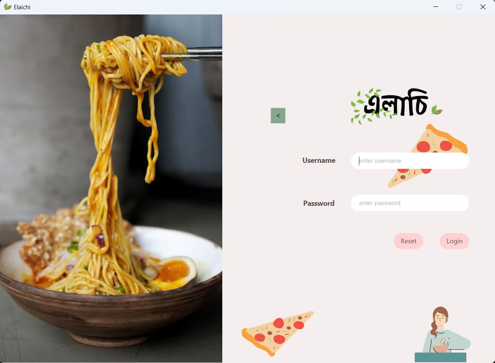
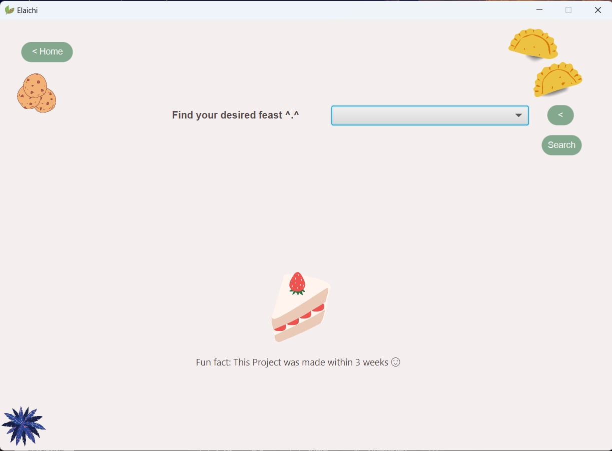
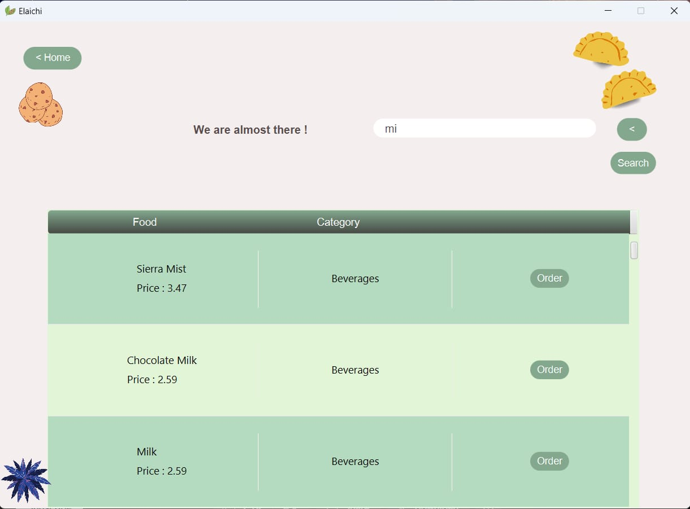
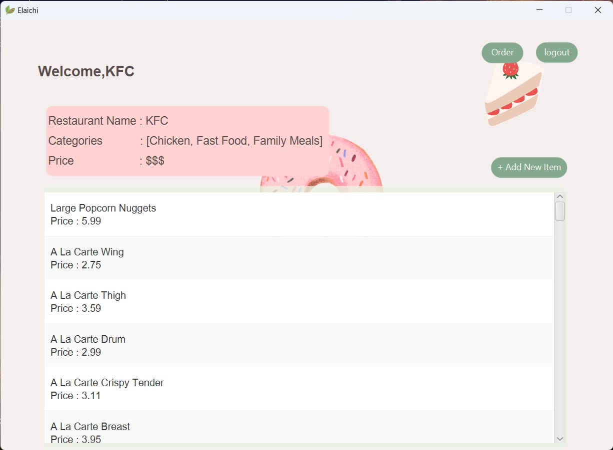
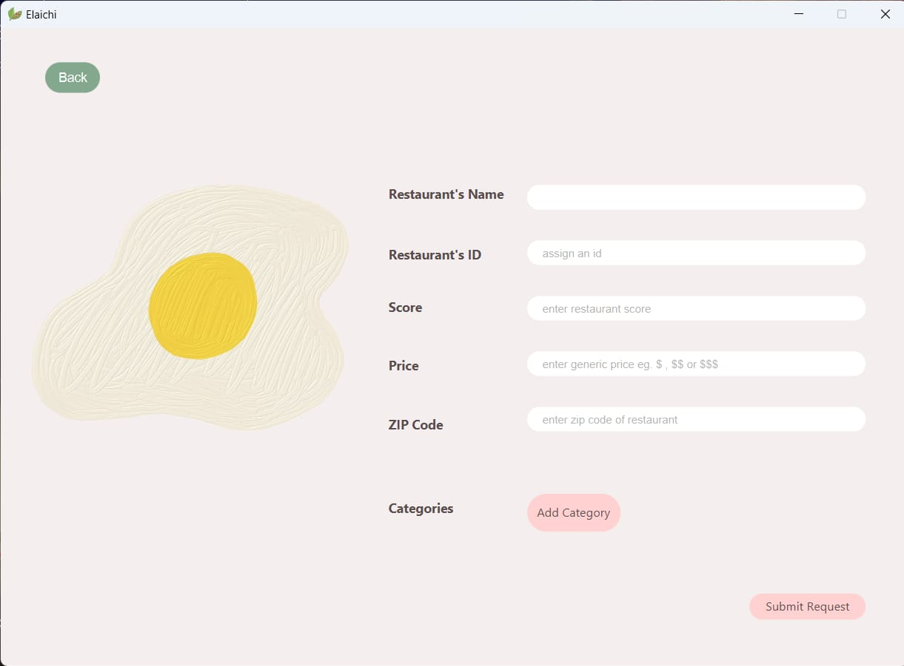
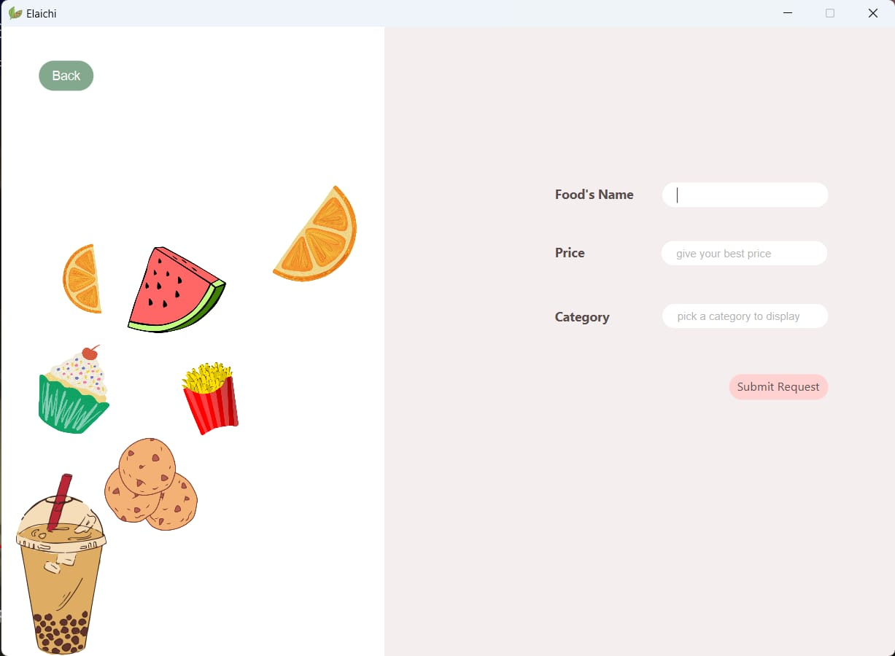
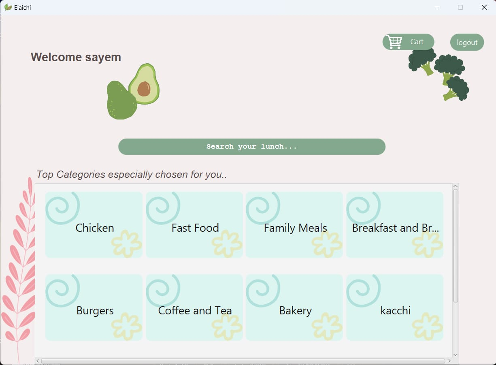

# 🍴 Elachi: A Food-Ordering App 🍴

Elachi is a food-ordering app developed using JavaFX for my L-1 T-2 academic project. The app allows users to add food items, search for specific items or categories, and offers a user-friendly interface.

## 🌟 Features:

- **🍽️ Profile-Based Restaurant Management:**
  - Each restaurant has a dedicated profile to manage their menu.
  <br>
    
- **🔒 Login System:**
  - Login for users, restaurants, and admins.
  <br>
    

- **🔍 Search and Filter:**
  - Users can search for restaurants, food items or browse categories.
  <br>
    
    

- **🛒 Cart and Ordering System:**
  - Proper cart functionality and streamlined ordering process.

- **🍽️ Restaurant creation, Menu and Order Management:**
  - Restaurant owners can create and use restaurant account to add new food to their menu as well as manage orders from customer.
  <br>
    
    
    

- **🎨 User-Friendly Design:**
  - Intuitive customer home page and appealing interface for easy navigation.
  <br>
    

---
## 🛠️ Compile and Test:
1. **Prerequisites**
  - OpenJDK-20
2. **Setup**
  ```bash
   # Clone the repository
   git clone https://github.com/RudraShivm/Elaichi.git
   
   # Navigate to src directory
   cd Elaichi/src
   
   # Compile Main.java
   javac Main.java
   
   # Run Main.java
   java Main
   ```